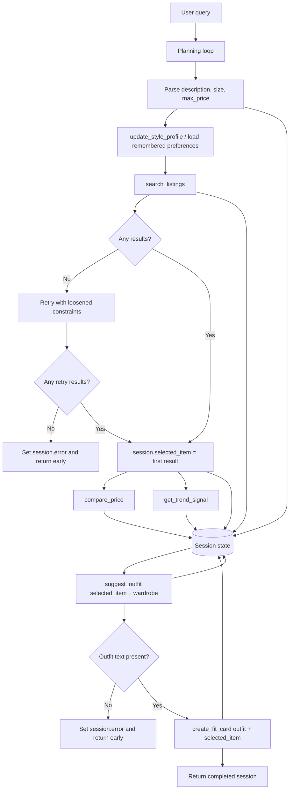

# FitFindr - planning.md

> Complete this document before writing any implementation code. This plan also records the stretch-feature updates made before implementation.

---

## Tools

### Tool 1: search_listings

**What it does:**
Searches `data/listings.json` for secondhand listings that match the user's requested item, optional size, and optional maximum price. It filters hard constraints first, scores the remaining listings by keyword/tag overlap, and returns the strongest matches first.

**Input parameters:**
- `description` (str): Natural-language keywords for the desired item, such as `"vintage graphic tee"` or `"black combat boots"`.
- `size` (str | None): Optional size filter from the user. Matching is case-insensitive and flexible enough for values like `"M"` to match `"S/M"` or `"M/L"`.
- `max_price` (float | None): Optional inclusive price ceiling. Listings above this price are filtered out before scoring.

**What it returns:**
A `list[dict]` of listing dictionaries sorted by descending relevance. Each result contains `id` (str), `title` (str), `description` (str), `category` (str), `style_tags` (list[str]), `size` (str), `condition` (str), `price` (float), `colors` (list[str]), `brand` (str | None), and `platform` (str). It returns `[]` if no listing passes the filters and relevance threshold.

**What happens if it fails or returns nothing:**
If the first search returns `[]`, the agent stores that in `session["search_results"]`, tries one automatic fallback search with loosened constraints, and tells the user what changed. If the retry also returns no matches, the agent sets `session["error"]` to a specific message suggesting a broader item description, a higher budget, or removing the size filter; it stops before outfit generation.

---

### Tool 2: suggest_outfit

**What it does:**
Suggests 1-2 outfit combinations using the selected listing and the user's wardrobe. If a trend signal is available, the suggestion uses it to shape the styling direction.

**Input parameters:**
- `new_item` (dict): One selected listing dictionary returned by `search_listings`.
- `wardrobe` (dict): A wardrobe dictionary with an `items` key containing wardrobe item dictionaries. Each wardrobe item includes `id`, `name`, `category`, `colors`, `style_tags`, and optional `notes`.

**What it returns:**
A non-empty `str` with one or two complete outfit ideas. With a populated wardrobe, it names specific pieces from `wardrobe["items"]`; with an empty wardrobe, it gives general styling guidance using item categories and colors the user could look for.

**What happens if it fails or returns nothing:**
If `wardrobe["items"]` is empty, the tool does not fail; it returns general styling advice. If the LLM call fails or returns a blank response, the tool falls back to a deterministic outfit suggestion based on the listing's category, colors, and style tags.

---

### Tool 3: create_fit_card

**What it does:**
Turns the selected listing and outfit suggestion into a short, shareable fit-card caption that sounds like an outfit post rather than a product listing.

**Input parameters:**
- `outfit` (str): The outfit suggestion returned by `suggest_outfit`.
- `new_item` (dict): The same selected listing dictionary stored in `session["selected_item"]`.

**What it returns:**
A `str` containing a 2-4 sentence caption. It naturally mentions the item title, price, and platform once and reflects the outfit's vibe.

**What happens if it fails or returns nothing:**
If `outfit` is empty or whitespace-only, the tool returns a descriptive error string explaining that it needs an outfit suggestion before it can make a fit card. If the LLM call fails or returns blank text, the tool returns a deterministic caption built from the item and outfit details.

---

### Tool 4: compare_price

**What it does:**
Compares the selected listing's price to similar listings in the mock dataset by category, style tags, and condition.

**Input parameters:**
- `item` (dict): The selected listing dictionary.
- `listings` (list[dict] | None): Optional comparable listing dataset. If omitted, the tool loads the full mock dataset with `load_listings()`.

**What it returns:**
A `dict` with `assessment` (str: `"good deal"`, `"fair price"`, or `"pricey"`), `item_price` (float), `average_comparable_price` (float), `comparable_count` (int), and `reasoning` (str) explaining which comparable listings were used.

**What happens if it fails or returns nothing:**
If there are too few comparable items, it falls back to category-level comparisons. If no category comparison is possible, it returns `"fair price"` with reasoning that the dataset is too small to make a confident call.

---

### Tool 5: get_trend_signal

**What it does:**
Returns current-style guidance for the selected item using a small curated trend signal map based on common public fashion tags and resale styling language represented in the assignment dataset.

**Input parameters:**
- `item` (dict): The selected listing dictionary.
- `size` (str | None): Optional user size from the parsed query.

**What it returns:**
A `dict` with `trend` (str), `source` (str), `matched_tags` (list[str]), and `styling_note` (str). This output is stored in session state and visibly included in the outfit suggestion panel.

**What happens if it fails or returns nothing:**
If no style tag matches the trend map, the tool returns a classic secondhand styling note based on the item's category and color so the planning loop can still proceed.

---

### Tool 6: update_style_profile

**What it does:**
Extracts style preferences from the user's query and wardrobe, then stores them in a local JSON profile so the next interaction can reuse those preferences without asking the user to re-enter them.

**Input parameters:**
- `query` (str): The user's current natural-language request.
- `wardrobe` (dict): The current wardrobe dictionary.
- `profile_path` (str): Local path for the profile JSON file.

**What it returns:**
A `dict` profile containing `preferred_tags` (list[str]), `preferred_colors` (list[str]), `notes` (list[str]), and `interaction_count` (int).

**What happens if it fails or returns nothing:**
If the profile file cannot be read, the tool starts from an empty profile. If it cannot write the file, the agent keeps the in-memory profile for this session and includes a warning in `session["profile_warning"]`.

---

## Planning Loop

The agent runs a conditional loop over explicit states:

1. Initialize session state with the original query, wardrobe, empty result fields, and no error.
2. Parse the query with regex and keyword cleanup:
   - `max_price` comes from phrases like `under $30`, `less than 30`, or `$30`.
   - `size` comes from phrases like `size M`, `in size 8`, `US 8`, or waist sizes like `W30`.
   - `description` is the remaining cleaned item request.
3. Load/update the style profile. If the query omits style preferences but a previous profile exists, append those remembered tags to the search description and store the profile in `session["style_profile"]`.
4. Call `search_listings(description, size, max_price)` and store the list in `session["search_results"]`.
5. If `search_results` is empty, enter the retry branch:
   - Retry once with size removed when a size was provided.
   - If still empty and `max_price` was provided, retry with a 25% higher budget.
   - Store the retry explanation in `session["retry_note"]`.
   - If retry results are still empty, set `session["error"]`, leave `selected_item`, `outfit_suggestion`, and `fit_card` as `None`, and return early.
6. If results exist, set `session["selected_item"] = search_results[0]`.
7. Call `compare_price(selected_item)` and store the result in `session["price_assessment"]`.
8. Call `get_trend_signal(selected_item, parsed["size"])` and store the result in `session["trend_signal"]`.
9. Call `suggest_outfit(selected_item, wardrobe)` while the tool reads trend context from the selected item/session-friendly metadata if present. Store the string in `session["outfit_suggestion"]`.
10. If `outfit_suggestion` is empty, set a specific error and return early.
11. Call `create_fit_card(outfit_suggestion, selected_item)` and store the result in `session["fit_card"]`.
12. Return the completed session.

The non-standard path differs from the happy path: when search returns no matches, the agent retries with loosened constraints and may return early without calling `suggest_outfit` or `create_fit_card`.

---

## State Management

The session dictionary is the single source of truth during one interaction. It stores `query`, `parsed`, `style_profile`, `search_results`, `retry_note`, `selected_item`, `price_assessment`, `trend_signal`, `wardrobe`, `outfit_suggestion`, `fit_card`, and `error`.

State flows forward without user re-entry: `search_listings` returns listing dicts, the top listing is stored as `session["selected_item"]`, and that exact dict is passed into `suggest_outfit`. The returned outfit string is stored as `session["outfit_suggestion"]`, and that exact string is passed into `create_fit_card`. Stretch state also flows forward: `compare_price` and `get_trend_signal` read the selected item, then their outputs are displayed and used to influence the styling text. Across interactions, `update_style_profile` writes remembered preferences to `.fitfindr_profile.json`, which is loaded during the next run.

---

## Error Handling

| Tool | Failure mode | Agent response |
|------|-------------|----------------|
| search_listings | No results match the query | Retry once with size removed, then with a slightly higher budget if needed. If still empty, return: "I couldn't find matches for that exact search. Try a broader item name, removing the size, or raising the budget." |
| suggest_outfit | Wardrobe is empty | Return general advice for what categories, colors, and silhouettes to pair with the item; do not crash or ask the user to re-enter a wardrobe. |
| create_fit_card | Outfit input is missing or incomplete | Return: "I need an outfit suggestion before I can make a fit card. Try running the outfit step again with a selected listing." |
| compare_price | Too few close comparable listings | Fall back to category-level comparison and explain the limited dataset in the reasoning. |
| get_trend_signal | No tag matches the trend map | Return a classic styling note based on category and color so the agent can keep going. |
| update_style_profile | Profile file is missing or not readable | Start with an empty profile, save what can be extracted from the current interaction, and continue. |

---

## Architecture

---

## AI Tool Plan

**Milestone 3 - Individual tool implementations:**
I will use Codex with the Tool 1, Tool 2, Tool 3, and stretch-tool blocks from this planning file. For `search_listings`, I will ask it to implement filtering and scoring using `load_listings()` and then verify the code with queries for graphic tees, jackets under a price limit, and impossible ballgowns. For `suggest_outfit` and `create_fit_card`, I will ask it to use Groq when available but include local fallbacks; I will verify empty wardrobe and empty outfit failure cases before wiring the agent.

**Milestone 4 - Planning loop and state management:**
I will give Codex the Planning Loop, State Management section, and Mermaid diagram. I expect it to implement `run_agent()` with the retry branch, session storage, price comparison, trend signal, and style memory. I will verify that a zero-result query does not call outfit/card generation, and that a happy-path session contains the exact selected listing dict and generated outfit string passed between tools.

**Documentation and verification:**
I will use Codex to draft README sections from this completed plan, then review the final README against the rubric line by line. I will run `pytest`, direct tool failure commands, and a simple Gradio handler smoke test before considering the implementation complete.

---

## A Complete Interaction (Step by Step)

**Example user query:** "I'm looking for a vintage graphic tee under $30. I mostly wear baggy jeans and chunky sneakers. What's out there and how would I style it?"

**Step 1:**
The agent parses `description="vintage graphic tee baggy jeans chunky sneakers"`, `size=None`, and `max_price=30.0`. It updates the style profile with remembered tags such as `vintage`, `baggy`, `streetwear`, and `chunky`.

**Step 2:**
The agent calls `search_listings(description="vintage graphic tee baggy jeans chunky sneakers", size=None, max_price=30.0)`. The tool returns matching listings such as `"Graphic Tee - 2003 Tour Bootleg Style"` and `"Vintage Band Tee - Faded Grey"`, each with full listing fields. The agent stores the list in `session["search_results"]` and stores the first result in `session["selected_item"]`.

**Step 3:**
The agent calls `compare_price(session["selected_item"])` to determine whether the selected tee is a good deal compared with similar tops and style tags. It stores the assessment and reasoning in `session["price_assessment"]`.

**Step 4:**
The agent calls `get_trend_signal(session["selected_item"], size=None)`. For a graphic/band tee, the trend signal returns styling guidance around grunge/streetwear resale tags and recommends baggy denim, chunky shoes, and lived-in layers. The agent stores that in `session["trend_signal"]`.

**Step 5:**
The agent calls `suggest_outfit(new_item=session["selected_item"], wardrobe=example_wardrobe)`. The tool uses the same selected listing from Step 2 plus wardrobe pieces like "Baggy straight-leg jeans, dark wash" and "Chunky white sneakers" to produce a complete outfit suggestion influenced by the trend note.

**Step 6:**
The agent calls `create_fit_card(outfit=session["outfit_suggestion"], new_item=session["selected_item"])`. The fit card uses the selected tee's title, price, and platform plus the generated outfit idea.

**Final output to user:**
The user sees the top listing details, a price assessment, a trend note, a complete outfit suggestion, and a shareable fit-card caption. If the search had found no results, the user would instead see the retry explanation and a specific suggestion to broaden the search.
